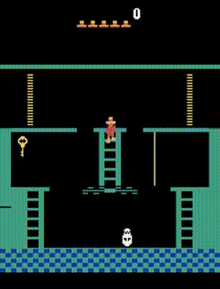

# lightning_rnd

Reimplementation on Random Network Distillation for a TPU machine

# ToDo

- [x] Separate actor and learner
- [x] Log number of rooms visited
- [x] Add optional V-trace targets correction
- [ ] Add TPU support
- [ ] Add fp16 support 

# Examples

Montezuma Revenge

